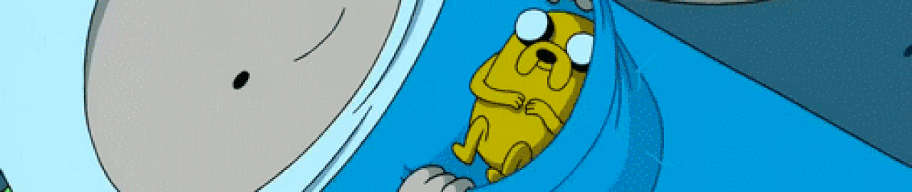

###

###

    
<b>👻 My skills</b>

### Main:
&nbsp;
&nbsp;
&nbsp;

### Tools:
&nbsp;
&nbsp;
&nbsp;
&nbsp;

### OS:
&nbsp;
&nbsp;
&nbsp;

### Others:
&nbsp;
&nbsp;
&nbsp;
&nbsp;
&nbsp;
&nbsp;

###

  
<b>✨ Stats</b>

  
  
     
    
  

  

  

###

    
<b>🍭 Games I play</b>

###

##

  
  

###
##

###

  
<b>🐍 Snake</b>

  <picture>
  <source media="(prefers-color-scheme: dark)" srcset="https://raw.githubusercontent.com/platane/platane/output/github-contribution-grid-snake-dark.svg">
  <source media="(prefers-color-scheme: light)" srcset="https://raw.githubusercontent.com/platane/platane/output/github-contribution-grid-snake.svg">
  
</picture>

